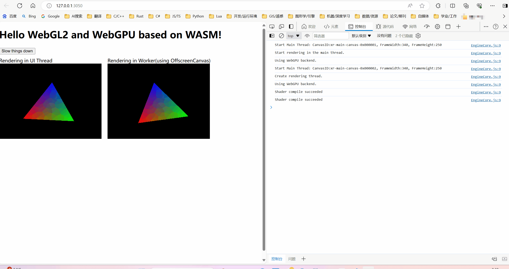

# Project Description
This is a project that uses C++ to test the use of webgl and webgpu in OffscreenCanvas. So, it is also an webgl/webgpu offscreencanvas demo. Based on OpenGL(GLES3), WebGPU(webgpu.h implementation：webgpu_cpp.h) from Emscripten, it is compiled into a WebAssembly module from C++ code, and ultimately uses webgl2 and webgpu through OffscreenCanvas in modern browsers. A more complete usage approach that can track this project: [https://github.com/xrui94/iEngine](https://github.com/xrui94/iEngine).



- **Features:**
  - Support selecting to get context from canvas or OffscreenCanvas
  - Support multi-threaded rendering when using OffscreenCanvas (Rendering in a worker. As shown in the above figure, in some cases, the time-consuming task of the main thread (UI thread) can cause rendering lag issues.)
  - Support selecting WebGL2 or WebGPU as rendering backend
  - ES6 style WebAssembly module

- **Known issues:**
  - Event monitoring cannot directly control the DragState member variable of the Event class, and can only use the global g-DragState variable in a bad way.

## 1. API and Usage

```js
engine.startEngine(startupOpts)
```

There is only one API, and it only needs a **"startupOpts"** parameter, which is the object type in JS. It contains eight fields as shown in the following table.You can track this project: [https://github.com/xrui94/iEngine](https://github.com/xrui94/iEngine) for more usage methods. to learn more about how to implement webgl and webgpu usage in C++. 

field|type|desc
:-|:-|:-
containerId|string|The ID of a DIV element, which is considered as the parent element and is used to carry canvas
width|number|The width of DIV element
height|number|The height of DIV element
backend|string|The backend of the engine, with valid values of webgl2 or webgpu(default)
usingOffscreenCanvas|bool|Enable OffscreenCanvas
canvasId|string|The id of CANVAS element
customCanvas|bool|Whether to use a custom canvas
style|string|The style of canvas element

- **Note:**

You need to first configure your server as follows: Add **"Cross-Origin-Opener-Policy:same-origin"** and **"Cross-Origin-Embedder-Policy:require-corp"** to response headers in your server, please check [https://developer.chrome.com/blog/coep-credentialless-origin-trial?hl=zh-cn](https://developer.chrome.com/blog/coep-credentialless-origin-trial?hl=zh-cn) for more details.

- **Example 1**:

```js
<script type="module">
	import EngineCore from './lib/EngineCore.js'

	const canvasId = "xr-dxasf-0ddas-main-canvas";
	const container = document.getElementById("engine-container");

	EngineCore().then(engine => {
		engine.startEngine({
			containerId: "engine-container",
			width: container.clientWidth,
			height: container.clientHeight,
			backend: "webgpu",  // Valid values: webgl2 or webgpu
			usingOffscreenCanvas: true,
			canvasId: canvasId,
			customCanvas: false,
			style: ""   // A css text, it is only working when "customCanvas" is set to false
		});
	});
</script>
```

- **Example 2**:

If you want to define the canvas element, and pass it in the wasm initialization function as a property of the "Module" object ( an object with a fixed name in wasm ), you can do it follow this example:

```js
<script type="module">
	import EngineCore from './lib/EngineCore.js'

	const canvasId = "xr-dxasf-0ddas-main-canvas";
	const container = document.getElementById("engine-container");

	const Module = {
		canvas: (() => {
			const canvas = document.createElement('canvas');
			canvas.id = canvasId;
			canvas.style.cssText = `
				width: ${container.clientWidth}px;
				height: ${container.clientHeight}px;
				margin: 0;
				padding: 0;
			`;
			canvas.addEventListener("webglcontextlost", (e) => { alert('WebGL context lost. You will need to reload the page.'); e.preventDefault(); }, false);
			document.getElementById("engine-container").appendChild(canvas);
			return canvas;
		})(),
	};

	EngineCore(Module).then(engine => {
		engine.startEngine({
			containerId: "engine-container",
			width: container.clientWidth,
			height: container.clientHeight,
			backend: "webgpu",  // Valid values: webgl2 or webgpu
			usingOffscreenCanvas: true,
			canvasId: canvasId,
			customCanvas: true,
			style: ""   // A css text, it is only working when "customCanvas" is set to false
		});
	});
</script>
```

## 2. Compile and Build

- First, make a build directory

```ps
mkdir dist
cd dist
```

- Generate the Ninja project file

**Replace** the value of the parameter **"- DCMAKE-TOOLCHAIN-FILE"** with the absolute path of your Emscripten.cmake file.

- **Note**:
  - If **emscripten tool chain**(or call it **"emsdk"**) is not installed, you need to first download and install it according to this instructions: [https://emscripten.org/docs/getting_started/downloads.html](https://emscripten.org/docs/getting_started/downloads.html);
  - If there is no **Ninja** in your system env, you need to first download a from [https://github.com/ninja-build/ninja/releases](https://github.com/ninja-build/ninja/releases) and configure system environment variables for it!

```ps
cmake .. -DCMAKE_TOOLCHAIN_FILE="C:/env/emsdk/upstream/emscripten/cmake/Modules/Platform/Emscripten.cmake" -G "Ninja"
```

- Build

```ps
ninja
```

## 3. Run

- First, Install dependencies

```ps
pnpm i
```

- Second, Prepare HTTPS service **( optional )**

**If you do not need to access the application through an IPV4 address, you can skip this step.** Use OpenSSL tool to generate certificates for HTTPS protocol services.Here 's a simple example:

```ps
.\openssl.exe req -nodes -new -x509 -keyout C:\Users\xrui94\Desktop\a\test_server.key -out C:\Users\xrui94\Desktop\a\test_server.cert
```

- Third, use the app

After executing the command bellow, you can use the app by opening the url [http://localhost:3050/](http://localhost:3050/) in browser. **However**, When using multi-threads with "Cross-Origin-Opener-Policy:same-origin" and "Cross-Origin-Embedder-Policy:require-corp" response headers, you **must** be use the **IPV4 host** to access app by opening the url: [http://YourIPV4Address:3051](http://YourIPV4Address:3051)

```ps
npm start
```

## 4. Reference and Thanks

In this project, some code has been referenced from the following projects:
- webgpu basic rendering example: https://github.com/emscripten-core/emscripten/blob/main/test/webgpu_basic_rendering.cpp
- A simple wgpu example：https://github.com/eliemichel/LearnWebGPU-Code/tree/step050
- webgpu cross platform demo：https://github.com/kainino0x/webgpu-cross-platform-demo
- web端子线程调用opengl es: https://blog.csdn.net/qq_34754747/article/details/108150004
